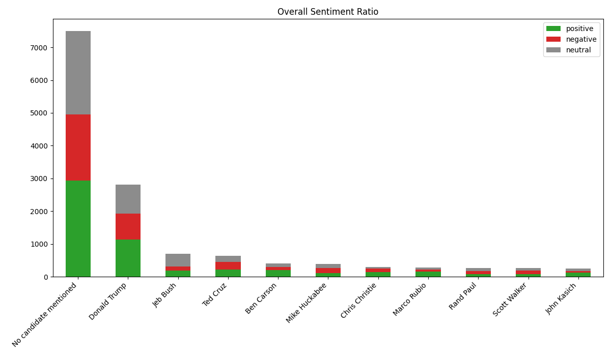
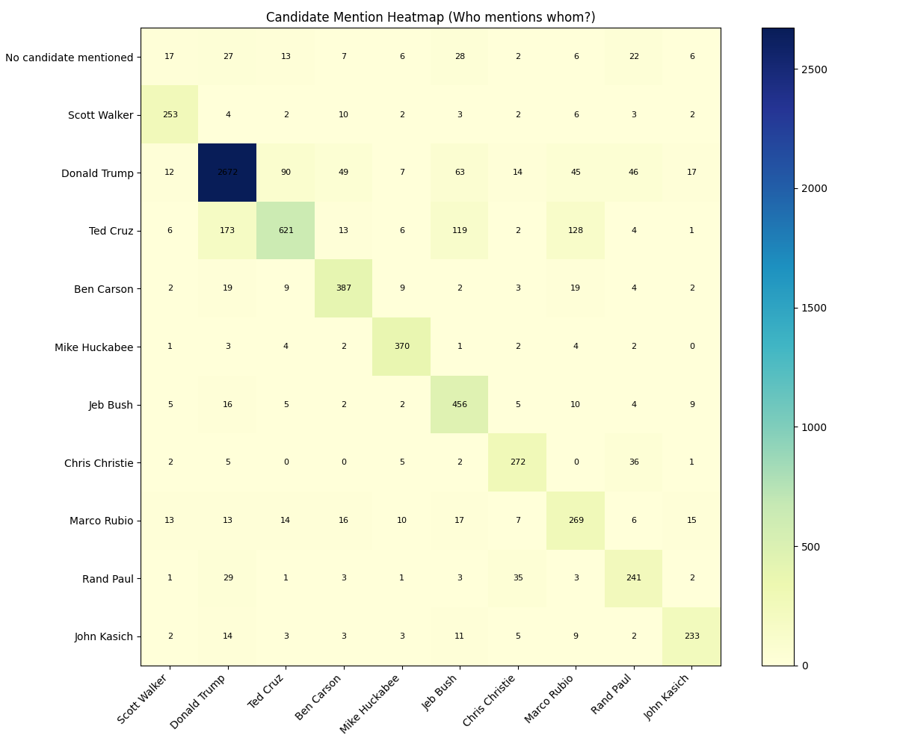
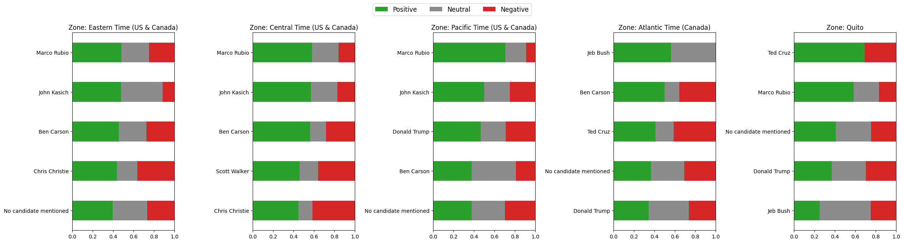
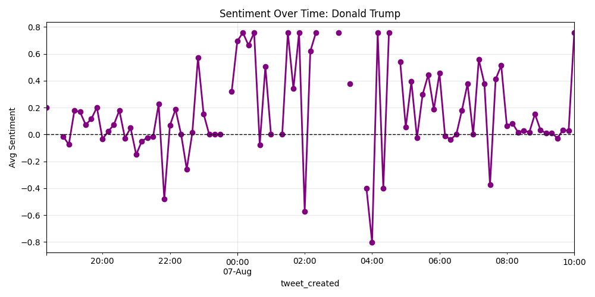
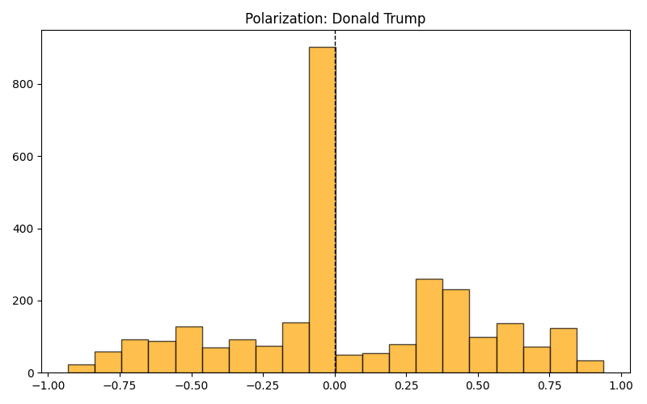
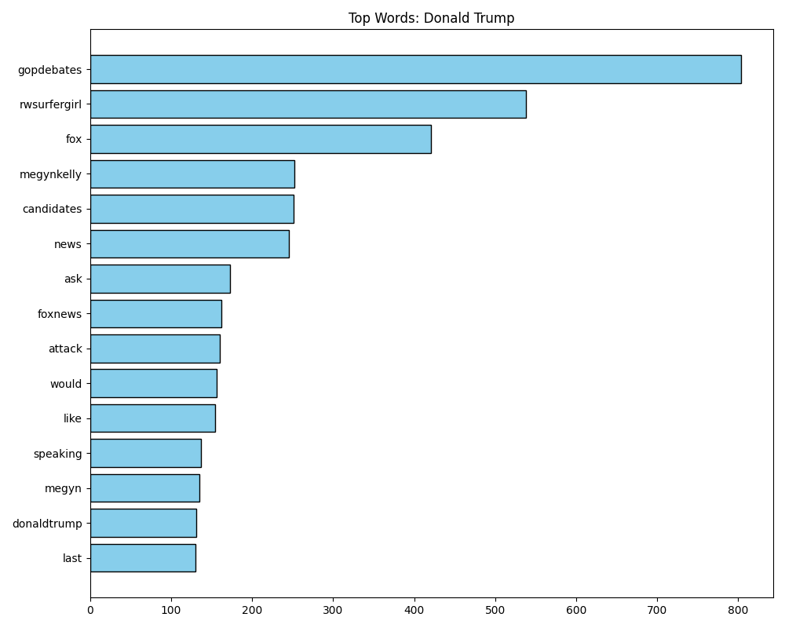
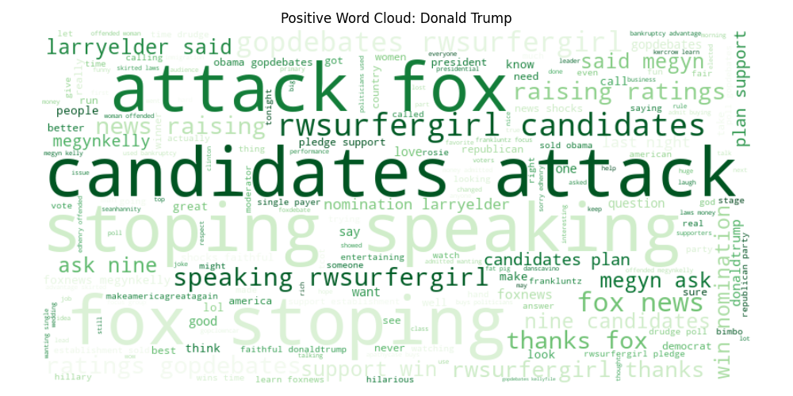
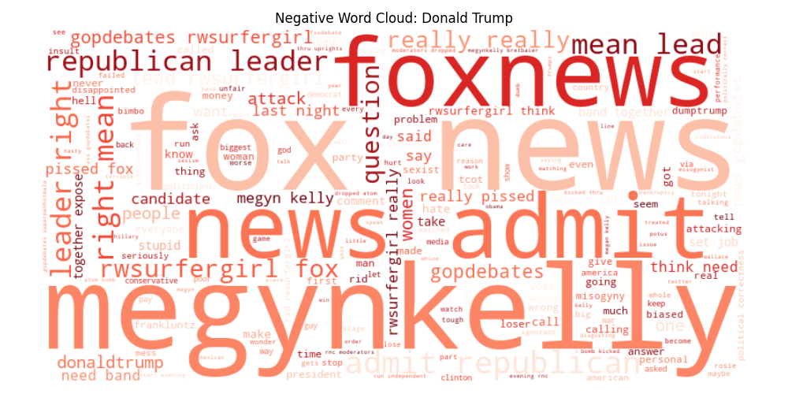
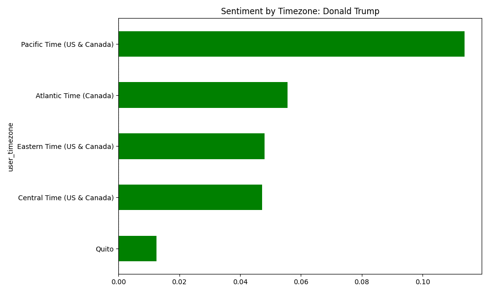

# Analýza sentimentu Twitteru (GOP Debate 2016)

**Předmět:** Strojové učení (AP7SU)  
**Jazyk:** Python (Pandas, NLTK, Matplotlib, WordCloud)  
**Autor:** Filip Hajduch

---

## 📌 O projektu
Tento projekt byl vypracován jako zápočtový úkol do předmětu **Strojové učení**. Cílem práce bylo analyzovat dataset tweetů týkajících se první republikánské prezidentské debaty v USA. 

Projekt zahrnuje kompletní "pipeline" zpracování dat:
1.  **Preprocessing:** Čištění textu, tokenizace, odstranění nevýznamných slov (stop words).
2.  **Analýza sentimentu:** Využití knihovny **NLTK (VADER)** pro klasifikaci nálady tweetů (pozitivní, negativní, neutrální).
3.  **Analýza témat:** Identifikace klíčových slov a frází pomocí frekvenční analýzy.
4.  **Vizualizace:** Generování grafů pro interpretaci výsledků.

---

## 🌍 Část 1: Globální analýza (Všichni kandidáti)
Tato sekce se zaměřuje na porovnání jednotlivých kandidátů mezi sebou a identifikaci celkových trendů v debatě.

### 1. Celkový přehled sentimentu
Skládaný sloupcový graf zobrazující celkový objem tweetů pro každého kandidáta, rozdělený podle sentimentu.


> **Co graf ukazuje:** > Je patrné, že **Donald Trump** dominoval celé debatě co do počtu zmínek (tzv. "buzz"). Ačkoliv má velký podíl negativních tweetů (červená část), **absolutní počet jeho pozitivních reakcí (zelená) je vyšší než celkový počet tweetů většiny ostatních kandidátů dohromady**. To potvrzuje, že vyvolával nejsilnější emoce a strhával na sebe veškerou pozornost.

### 2. Interakční heatmapa (Kdo mluví o kom)
Matice zobrazující, jak často se jméno jednoho kandidáta objevuje v tweetech, které primárně hovoří o někom jiném.


> **Co graf ukazuje:** > Tmavší barva znamená častější výskyt. Graf jasně ukazuje, že Trumpovo jméno se objevuje v kontextu téměř všech ostatních kandidátů. Byl ústředním bodem diskusí a ostatní kandidáti byli často srovnáváni právě s ním.

### 3. Regionální preference (Časové zóny)
Srovnání, kteří kandidáti měli největší podíl pozitivních reakcí v 5 největších časových zónách (regionech).


> **Co graf ukazuje:** > Graf zobrazuje TOP 5 "nejoblíbenějších" kandidátů pro každou zónu. Umožňuje nám vidět, zda má některý kandidát silnou základnu například na východním pobřeží (Eastern Time), ale propadá v jiných regionech.

---

## 🇺🇸 Část 2: Detailní analýza (Případová studie)

> **⚠️ Poznámka:** Program automaticky generuje tuto sadu detailních grafů pro **každého kandidáta** v datasetu (výstupy naleznete ve složce `results/images/`). 
> 
> Pro účely této dokumentace byl vybrán **Donald Trump**, a to z prostého důvodu: v datasetu má zdaleka **největší počet tweetů (2813)**. Díky tomu jsou jeho grafy statisticky nejprůkaznější a nejlépe demonstrují funkčnost analýzy.

### 4. Vývoj sentimentu v čase
Graf ukazuje průměrnou hodnotu sentimentu (klouzavý průměr) v průběhu vysílání debaty.


> **Interpretace:** > Křivka zachycuje okamžité reakce publika v reálném čase. 
> * **Propady dolů:** Značí kontroverzní výroky nebo momenty, kdy byl kandidát pod palbou kritiky moderátorů.
> * **Růst nahoru:** Momenty, kdy kandidát řekl něco, co u jeho voličské základny rezonovalo (vtipy, útoky na oponenty).

### 5. Polarizace názorů
Histogram rozložení skóre sentimentu (od -1 do 1).


> **Interpretace:** > Tento graf ukazuje, jak moc kandidát rozděluje společnost. 
> * U Trumpa vidíme lehce negativní posun, což znamená, že více lidí reagovalo negativně než pozitivně. 

### 6. Nejčastější slova (Frekvenční analýza)
Sloupcový graf zobrazující slova, která se v tweetech o kandidátovi vyskytovala nejčastěji.


> **Interpretace:** > Graf nám dává rychlý kontext. Vidíme zde silné zastoupení slov jako **"Fox"**, **"News"** nebo **"Megyn"**. To nám říká, že hlavním tématem diskusí nebyl ani tak politický program, jako spíše Trumpův mediální spor s moderátorkou Megyn Kelly a stanicí Fox News.

### 7. Word Clouds (Analýza témat podle nálady)
Vizuální reprezentace slovní zásoby rozdělená na pozitivní a negativní kontext.

**👍 Pozitivní kontext:**

> Zde vidíme, co se lidem líbilo. Dominují slova spojená s lídrovstvím a silou: **"attack", "candidates", "fox", "speaking"**.

**👎 Negativní kontext:**

> Zde vidíme témata kritiky. Opět dominují média (**"Fox News"**, **"Megyn Kelly"**), což naznačuje, že negativní sentiment byl často spojen s jeho chováním vůči moderátorům, nikoliv nutně s jeho politikou.

### 8. Geografická analýza sentimentu
Průměrný sentiment tweetů rozdělený podle časové zóny uživatele.


> **Interpretace:** > Zelené sloupce značí regiony, kde převažoval pozitivní sentiment, červené tam, kde převažoval negativní. Graf odhaluje, kde má kandidát své "domácí hřiště" a kde naopak naráží na odpor. U Trumpa je TOP 5 regionů s pozitivním sentimentem rozprostřena napříč celými USA, což svědčí o jeho široké základně podpory.

---

## 💻 Textový výstup analýzy (Konzole)

Kromě grafických výstupů provádí skript detailní **textovou analýzu v reálném čase**. Pro **každého jednotlivého kandidáta** (nejen pro Trumpa) se do konzole vypisují podrobné statistiky, které slouží k hlubšímu pochopení kontextu.

Výstup pro každého kandidáta obsahuje:
1.  **Obecná analýza:** Frekvence slov a kolokace (fráze) bez ohledu na sentiment.
2.  **Konkordance (Concordance):** Ukázka kontextu, ve kterém se klíčová slova vyskytují (např. v jaké větě bylo použito slovo "wall").
3.  **VADER skóre:** Přesné počty pozitivních, negativních a neutrálních tweetů.
4.  **Separátní analýza témat:** Unikátní témata, která se řeší jen v pozitivním nebo jen v negativním kontextu.

**Ukázka reálného výstupu z konzole pro Donalda Trumpa (zkráceno):**

```text
===== Analyzing: Donald Trump =====

=== OBECNÁ ANALÝZA (všechny tweety) pro: Donald Trump ===
Top 10 témat (Frekvence):
[('gopdebates', 803), ('rwsurfergirl', 538), ('fox', 421), ('megynkelly', 252), ('news', 245)...]

Časté fráze (Kolokace):
fox news; gopdebates rwsurfergirl; stoping speaking; last night; candidates attack

Kontext pro top 3 témata (Shody):
--- Kontext pro slovo: 'fox' ---
ratings history presidential debates fox say thanks rushlimbaugh americans get
ed need remember elected george twice fox news agenda promote carly never menti
stonishingly biased order take wonder fox news one took order seriously amymek 

=======================================================
Running VADER sentiment analysis on 2813 tweets for Donald Trump...
Found 1130 positive, 795 negative, and 888 neutral tweets.

--- Analýza POZITIVNÍCH témat (čemu se věnovat) ---
Top 10 témat: [('gopdebates', 257), ('fox', 248), ('rwsurfergirl', 232), ('candidates', 227)...]
Časté fráze: stoping speaking; fox stoping; raising ratings; candidates attack

--- Analýza NEGATIVNÍCH témat (čemu se vyhnout) ---
Top 10 témat: [('fox', 126), ('gopdebates', 125), ('rwsurfergirl', 107), ('news', 106)...]
Časté fráze: fox news; admit republican; mean lead; republican leader
```


## 📝 Závěr a vyhodnocení favorita

Analýza tohoto datasetu přináší zajímavý pohled na to, jak funguje moderní politická kampaň na sociálních sítích:

1.  **Dominance pozornosti:** Donald Trump měl absolutně nejvyšší počet zmínek. I když měl vysoký poměr negativních reakcí, jeho **"Share of Voice"** (podíl na hluku) byl drtivý. Ostatní kandidáti vedle něj působili neviditelně.
2.  **Síla fanouškovské základny:** I přes kritiku měl Trump v absolutních číslech **nejvíce pozitivních tweetů**. To indikuje silné a mobilizované jádro voličů, které je na Twitteru aktivnější než u jiných kandidátů.
3.  **Favorit voleb:** Pokud bychom se řídili pouze průměrným sentimentem (kdo je "nejmilejší"), Trump by nevyhrál. Pokud se ale na data podíváme optikou "Attention Economy" (ekonomiky pozornosti), Trump z analýzy vychází jako **jasný favorit**. 

Data potvrzují známé pravidlo politického marketingu: **Negativní reklama je také reklama, pokud o vás všichni mluví.**